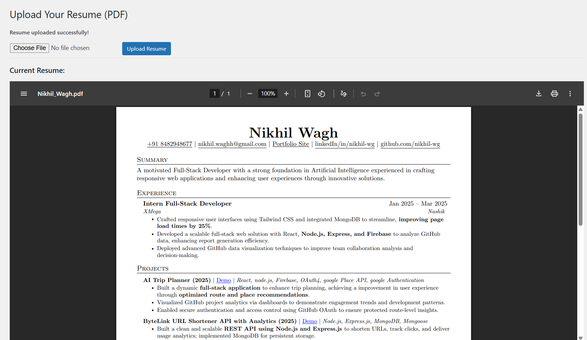

# Resume Viewer Plugin

A simple Gutenberg block plugin that allows users to embed a resume section directly into any WordPress page or post.

> ✅ Built using the official WordPress Create Block tool.

---

## ✨ Features

- 🧱 Gutenberg block support
- 📄 Clean, customizable resume layout
- ⚙️ Easy to insert and edit using block editor
- 🎨 Compatible with any block-based WordPress theme

---

## 📦 Installation

1. Clone or download this repository.
2. Copy the `nikhil-plugin` folder to your WordPress installation under:  
   `/wp-content/plugins/`
3. In your WordPress Admin Panel:
   - Go to **Plugins > Installed Plugins**
   - Activate **Nikhil Plugin**
4. Edit any page/post and add the block: **"Nikhil Resume Block"**

---

## 🚀 Usage

- Go to the WordPress Block Editor
- Add the **Nikhil Resume Block**
- Fill in your resume fields (experience, education, etc.)
- Publish or preview to see your resume in action!

---

## 🖼 Screenshots

 

> Screenshots are stored in the `/assets/` directory of this repo.

